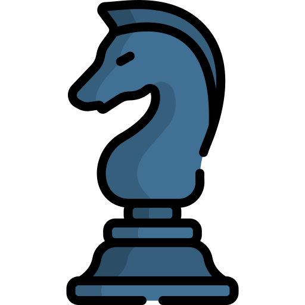
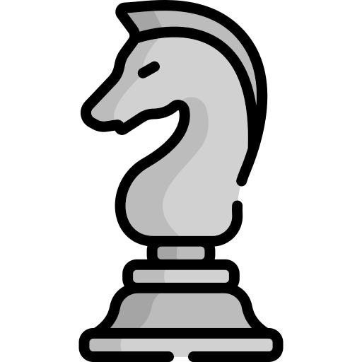
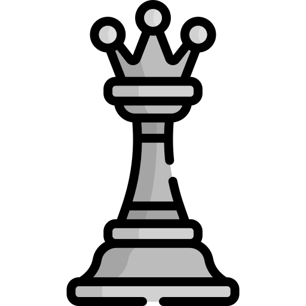

<!--STARTS_HERE_QUOTE_README-->
<i>❝“Make everything as simple as possible, but not simpler.”— Albert Einstein   ❞</i>
<!--ENDS_HERE_QUOTE_README-->

# About Me 👋

<b>“</b>Full-stack developer, Pro-refact and minecraft coding euthathist.<b>”</b>

<b><a href="https://rodzmc.xyz/" alt="My Website and Blogs">Website</a></b> | <b><a href="https://rodzmc.xyz/?p=youtube" alt="My Youtube Channel">Youtube</a></b> | <b><a href="https://rodzmc.xyz/?p=twitter" alt="twitter">Twitter</a></b> | <b><a href="https://rodzmc.xyz/?p=discord" alt="My Discord Account">Discord</a></b>

- Contributed to **Several Repository** Related on **Minecraft-Things** 🔥
- Reverse-Engineer since 2019, Currently working **Go and Rust** 🏆
- **Experienced** since 2016, Currently my native language is **PHP and C#/C++** 🎖
- Minecraft Bedrock Cheater (Mostly uses **Horion Open Source**) for Custom Client. 🏓
- Developing **Discord Bots** using **Javascript and Python** ✨
- **Hacker and Debugger** on Static Programs (Specially for **C#, C++, and Websites**) 🎯
- Client Program **Bug Hunter** (Specially on Popular Programs such as **Discord**) 🕹

   
<b>My Statistics</b>

   ## Github Statistics
   
   
   ## Top Languages
   
   
   
   ## My Trophy
   
   ## Wakatime
   
   ## Streak
   
   ## Metrics
   
   ## Discord Status
   
   ## Spotify Status
   
   ## Github Contribution Graph
   
   
   

- Github Commiter and **Active Developer** on **Several Organizations** 🟢
- Issuer and Definitely **Github Explorer** 🌐

   
<b>My Lovely Projects.</b>

   ## Favorate Projects
   
   
   
   
   
   
   
   
   

- Specially my **Favorite Minecraft Software** is **PocketMine-MP, and Dragonfly** which written in PHP and Golang. 🪐
- Some of my projects related on PocketMine-MP Plugins.
- Using **PHPStorm**, **Visual Studio Code** (for programs and dlls), **Notepad++** (definitely using for normal text editing ~~not advanced~~) 💥

    
<b>My Achievements</b>

   ## Github Achievements
   | Name | Date | Tier | Icon | Status |
   |------|------|----------|---------|---------|
   | [YOLO](https://github.com/xRodzMC?achievement=yolo&tab=achievements) |`Jul 19`|   **100%**   |         |    ✔  |
   |  [Pull Shark](https://github.com/xRodzMC?achievement=pull-shark&tab=achievements)    |  `May 14`    |  **x2** |        |     ✔    |
   |   [QuickDraw](https://github.com/xRodzMC?achievement=quickdraw&tab=achievements)   |   `Apr 13`  |     **100%**     |         |   ✔      |
   | [Pair Extraordinaire](https://github.com/xRodzMC?achievement=pair-extraordinaire&tab=achievements) | `Aug 5` | **x1** |  | ✔ |
   | [Galaxy Brain](https://github.com/xRodzMC?achievement=galaxy-brain&tab=achievements) | `Aug 5` | **x3** |  | ✔ |

- Definitely Github Achievements Hopper 🖥
- Specially using Github for Storing Projects and Making Open Source.
- Prefer's Open Source Projects. 💖

    
<b>My Organizations</b>

  ## Organizations
  | Name | Date | Status | Logo | Rank |
  |------|------|--------|---------|------|
  |[`@ReinfyTeam`](https://github.com/ReinfyTeam)|`Jul 17`|✔||Owner|
  |[`@PrideMC`](https://github.com/PrideMC)|`Feb 12`|✔||Founder|
  |[`@Minco-Inc`](https://github.com/Minco-Inc)|`Apr 17`|✔||Member|
  |[`@xqwtxon-pm-pl`](https://github.com/xqwtxon-pm-pl)|`Sept 4`|✔||Founder
  |[`@sjtwp`](https://github.com/sjtwp)|`Oct 8`|✔||Founder

- Im currently working on **ReinfyTeam** 💼
- I am founder of a Minecraft Server called **PrideMC** 👑
- I am serious developer which talking about program **security vulnerabilities**. 🎓
- I am aware developer for **pull request, reviewing codes, and issue/bugs.** 🎩

# Games 🎮
If you **bored**, you can also play on my games! 🥱
- **2048**: is a single-player sliding tile puzzle video game written by Italian web developer Gabriele Cirulli and published on GitHub. ②⓪④⑧

    
<b>2048</b>

    

  ## 2048
  - **Game in progress. This is a public game of 2048. Anyone can play.**  
  - **It's your turn, click on a button below the board!**  

  <!-- 2048GameBoard -->
  
  <!-- 2048GameBoard -->

  <!-- 2048GameActions -->
     
  <!-- 2048GameActions -->

  ## 2048 Leaderboard

  <!-- 2048Ranking -->
| Players | Actions |
|---------------|:---------:|
| [@xRodzMC](https://github.com/xRodzMC) | 2 |
| [@Phqzing](https://github.com/Phqzing) | 1 |
<!-- 2048Ranking -->

- **Chess**: is a board game played between two players. It is sometimes called Western chess or international chess to distinguish it from related games such as xiangqi and shogi. ♟️

   
<b>Chest</b>

   ## Chess
   - It's your turn to play! Move a <!-- BEGIN TURN -->black<!-- END TURN --> piece.
      - This is an open chess tournament where ANYONE can play. That's the fun part.  
  
<!-- BEGIN CHESS BOARD -->
|   | A | B | C | D | E | F | G | H |   |
|---|:-:|:-:|:-:|:-:|:-:|:-:|:-:|:-:|:-:|
| **8** |  |  |  |  |  |  |  |  | **8** |
| **7** |  |  |  |  |  |  |  |  | **7** |
| **6** |  |  |  |  |  |  |  |  | **6** |
| **5** |  |  |  |  |  |  |  |  | **5** |
| **4** |  |  |  |  |  |  |  |  | **4** |
| **3** |  |  |  |  |  |  |  |  | **3** |
| **2** |  |  |  |  |  |  |  |  | **2** |
| **1** |  |  |  |  |  |  |  |  | **1** |
|   | **A** | **B** | **C** | **D** | **E** | **F** | **G** | **H** |   |
<!-- END CHESS BOARD -->

   - **It's your turn to move! Choose one from the following table**
<!-- BEGIN MOVES LIST -->
|  FROM  | TO (Just click a link!) |
| :----: | :---------------------- |
| **A7** | [A5](https://github.com/xRodzMC/xRodzMC/issues/new?body=Please+do+not+change+the+title.+Just+click+%22Submit+new+issue%22.+You+don%27t+need+to+do+anything+else+%3AD&title=Chess%3A+Move+A7+to+A5), [A6](https://github.com/xqwtxon/xqwtxon/issues/new?body=Please+do+not+change+the+title.+Just+click+%22Submit+new+issue%22.+You+don%27t+need+to+do+anything+else+%3AD&title=Chess%3A+Move+A7+to+A6) |
| **B7** | [B5](https://github.com/xRodzMC/xRodzMC/issues/new?body=Please+do+not+change+the+title.+Just+click+%22Submit+new+issue%22.+You+don%27t+need+to+do+anything+else+%3AD&title=Chess%3A+Move+B7+to+B5), [B6](https://github.com/xRodzMC/xRodzMC/issues/new?body=Please+do+not+change+the+title.+Just+click+%22Submit+new+issue%22.+You+don%27t+need+to+do+anything+else+%3AD&title=Chess%3A+Move+B7+to+B6) |
| **B8** | [A6](https://github.com/xRodzMC/xRodzMC/issues/new?body=Please+do+not+change+the+title.+Just+click+%22Submit+new+issue%22.+You+don%27t+need+to+do+anything+else+%3AD&title=Chess%3A+Move+B8+to+A6), [C6](https://github.com/xRodzMC/xRodzMC/issues/new?body=Please+do+not+change+the+title.+Just+click+%22Submit+new+issue%22.+You+don%27t+need+to+do+anything+else+%3AD&title=Chess%3A+Move+B8+to+C6) |
| **C7** | [C5](https://github.com/xRodzMC/xRodzMC/issues/new?body=Please+do+not+change+the+title.+Just+click+%22Submit+new+issue%22.+You+don%27t+need+to+do+anything+else+%3AD&title=Chess%3A+Move+C7+to+C5), [C6](https://github.com/xRodzMC/xRodzMC/issues/new?body=Please+do+not+change+the+title.+Just+click+%22Submit+new+issue%22.+You+don%27t+need+to+do+anything+else+%3AD&title=Chess%3A+Move+C7+to+C6) |
| **D7** | [D5](https://github.com/xRodzMC/xRodzMC/issues/new?body=Please+do+not+change+the+title.+Just+click+%22Submit+new+issue%22.+You+don%27t+need+to+do+anything+else+%3AD&title=Chess%3A+Move+D7+to+D5), [D6](https://github.com/xRodzMC/xRodzMC/issues/new?body=Please+do+not+change+the+title.+Just+click+%22Submit+new+issue%22.+You+don%27t+need+to+do+anything+else+%3AD&title=Chess%3A+Move+D7+to+D6) |
| **E7** | [E5](https://github.com/xRodzMC/xRodzMC/issues/new?body=Please+do+not+change+the+title.+Just+click+%22Submit+new+issue%22.+You+don%27t+need+to+do+anything+else+%3AD&title=Chess%3A+Move+E7+to+E5), [E6](https://github.com/xRodzMC/xRodzMC/issues/new?body=Please+do+not+change+the+title.+Just+click+%22Submit+new+issue%22.+You+don%27t+need+to+do+anything+else+%3AD&title=Chess%3A+Move+E7+to+E6) |
| **F7** | [F5](https://github.com/xRodzMC/xRodzMC/issues/new?body=Please+do+not+change+the+title.+Just+click+%22Submit+new+issue%22.+You+don%27t+need+to+do+anything+else+%3AD&title=Chess%3A+Move+F7+to+F5), [F6](https://github.com/xRodzMC/xRodzMC/issues/new?body=Please+do+not+change+the+title.+Just+click+%22Submit+new+issue%22.+You+don%27t+need+to+do+anything+else+%3AD&title=Chess%3A+Move+F7+to+F6) |
| **G7** | [G5](https://github.com/xRodzMC/xRodzMC/issues/new?body=Please+do+not+change+the+title.+Just+click+%22Submit+new+issue%22.+You+don%27t+need+to+do+anything+else+%3AD&title=Chess%3A+Move+G7+to+G5), [G6](https://github.com/xRodzMC/xRodzMC/issues/new?body=Please+do+not+change+the+title.+Just+click+%22Submit+new+issue%22.+You+don%27t+need+to+do+anything+else+%3AD&title=Chess%3A+Move+G7+to+G6) |
| **G8** | [F6](https://github.com/xRodzMC/xRodzMC/issues/new?body=Please+do+not+change+the+title.+Just+click+%22Submit+new+issue%22.+You+don%27t+need+to+do+anything+else+%3AD&title=Chess%3A+Move+G8+to+F6), [H6](https://github.com/xRodzMC/xRodzMC/issues/new?body=Please+do+not+change+the+title.+Just+click+%22Submit+new+issue%22.+You+don%27t+need+to+do+anything+else+%3AD&title=Chess%3A+Move+G8+to+H6) |
| **H7** | [H5](https://github.com/xqwtxon/xqwtxon/issues/new?body=Please+do+not+change+the+title.+Just+click+%22Submit+new+issue%22.+You+don%27t+need+to+do+anything+else+%3AD&title=Chess%3A+Move+H7+to+H5), [H6](https://github.com/xRodzMC/xRodzMC/issues/new?body=Please+do+not+change+the+title.+Just+click+%22Submit+new+issue%22.+You+don%27t+need+to+do+anything+else+%3AD&title=Chess%3A+Move+H7+to+H6) |
<!-- END MOVES LIST -->

   ### Leaderboard
<!-- BEGIN LAST MOVES -->

| Move | Author |
| :--: | :----- |
| `D2` to `D3` | [ @xqwtxon](https://github.com/xRodzMC) |
| `Start game` | [ @xqwtxon](https://github.com/xRodzMC) |

<!-- END LAST MOVES -->

<!-- BEGIN TOP MOVES -->

| Total moves |  User  |
| :---------: | :----- |
| 1 | [@xqwtxon](https://github.com/xRodzMC) |

<!-- END TOP MOVES -->

- **Connect Four**: is a two-player connection board game, in which the players choose a color and then take turns dropping colored tokens into a seven-column, six-row vertically suspended grid. 🟡

  
<b>Connect4</b>

  ## Connect4
  - Here you can play Connect4. Just click a number under the grid to move. It's <!-- BEGIN TURN2 -->red<!-- END TURN2 --> turn.
  
  <!-- BEGIN CONNECT4 BOARD -->
|   | 1 | 2 | 3 | 4 | 5 | 6 | 7 |   |
|---|:-:|:-:|:-:|:-:|:-:|:-:|:-:|:-:|
|---| |  |  |  |  |  |  | |---|
|---| |  |  |  |  |  |  | |---|
|---| |  |  |  |  |  |  | |---|
|---| |  |  |  |  |  |  | |---|
|---| |  |  |  |  |  |  | |---|
|---| |  |  |  |  |  |  | |---|
|   | [1](https://github.com/xRodzMC/xRodzMC/issues/new?body=Please+do+not+change+the+title.+Just+click+%22Submit+new+issue%22.+You+don%27t+need+to+do+anything+else+%3AD&title=Connect4%3A+Put+1) | [2](https://github.com/xRodzMC/xRodzMC/issues/new?body=Please+do+not+change+the+title.+Just+click+%22Submit+new+issue%22.+You+don%27t+need+to+do+anything+else+%3AD&title=Connect4%3A+Put+2) | [3](https://github.com/xRodzMC/xRodzMC/issues/new?body=Please+do+not+change+the+title.+Just+click+%22Submit+new+issue%22.+You+don%27t+need+to+do+anything+else+%3AD&title=Connect4%3A+Put+3) | [4](https://github.com/xRodzMC/xRodzMC/issues/new?body=Please+do+not+change+the+title.+Just+click+%22Submit+new+issue%22.+You+don%27t+need+to+do+anything+else+%3AD&title=Connect4%3A+Put+4) | [5](https://github.com/xRodzMC/xRodzMC/issues/new?body=Please+do+not+change+the+title.+Just+click+%22Submit+new+issue%22.+You+don%27t+need+to+do+anything+else+%3AD&title=Connect4%3A+Put+5) | [6](https://github.com/xRodzMC/xRodzMC/issues/new?body=Please+do+not+change+the+title.+Just+click+%22Submit+new+issue%22.+You+don%27t+need+to+do+anything+else+%3AD&title=Connect4%3A+Put+6) | [7](https://github.com/xRodzMC/xRodzMC/issues/new?body=Please+do+not+change+the+title.+Just+click+%22Submit+new+issue%22.+You+don%27t+need+to+do+anything+else+%3AD&title=Connect4%3A+Put+7) |   |
<!-- END CONNECT4 BOARD -->
  
  <!-- BEGIN MOVES LIST2 -->
<!-- END MOVES LIST2 -->
  
  # Leaderboard
  - Last 5 moves in this game
  <!-- BEGIN LAST MOVES2 -->

| Move | Author |
| :--: | :----- |
| `1` |  [ @xRodzMC](https://github.com/xRodzMC) | |
| `Start game` |  [ @xRodzMC](https://github.com/xRodzMC) | |

<!-- END LAST MOVES2 -->
  - Top 10 most moves across games!
  <!-- BEGIN TOP MOVES2 -->

| Total moves |  User  |
| :---------: | :----- |
| 1 |  [@xqwtxon](https://github.com/xRodzMC) | |

<!-- END TOP MOVES2 -->

# Discover 🌐
- Visit other profile's and discover newly users on github! 🙌
<table><tbody><tr><td>  </td></tr></tbody></table>

# Sponsor 🙌

Visit my <b><a href="https://github.com/sponsors/xRodzMC/">Sponsor Profile</a></b> or click the sponsor button.

- Sponsoring in github will help me alot of things.
  - Only **$1.00** will help me alot, even cheaper price of sponsorship.
  - Its helps me alot, to continue making **open source project for everyone**.
  - What will happend if, i have **more sponsors**? What projects or repositories **could i do?**
  - Gives me alot of **motivation** from my projects specially when **expecting a bugs or issues**.
  - Sponsoring me will **help alot of people**.

- Thanks for people, who sponsoring me!
<!-- sponsors --><!-- sponsors -->

<!--RECENT_ACTIVITY:start-->
<!--RECENT_ACTIVITY:end-->

<!--RECENT_ACTIVITY:last_update-->
<i>Last refresh</i>: <b>Monday, September 7th, 2026, 5:42:09 PM</b>
<!--RECENT_ACTIVITY:last_update_end-->
  
